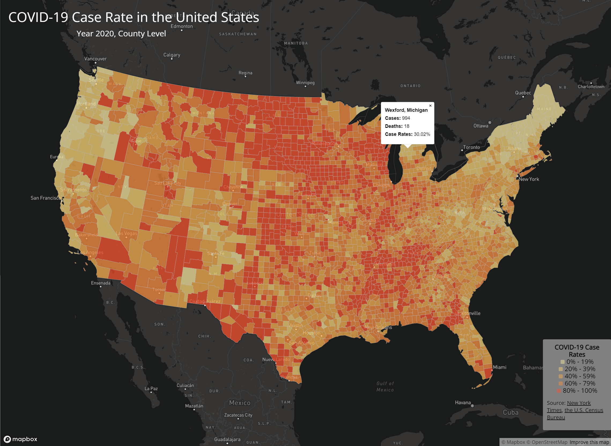
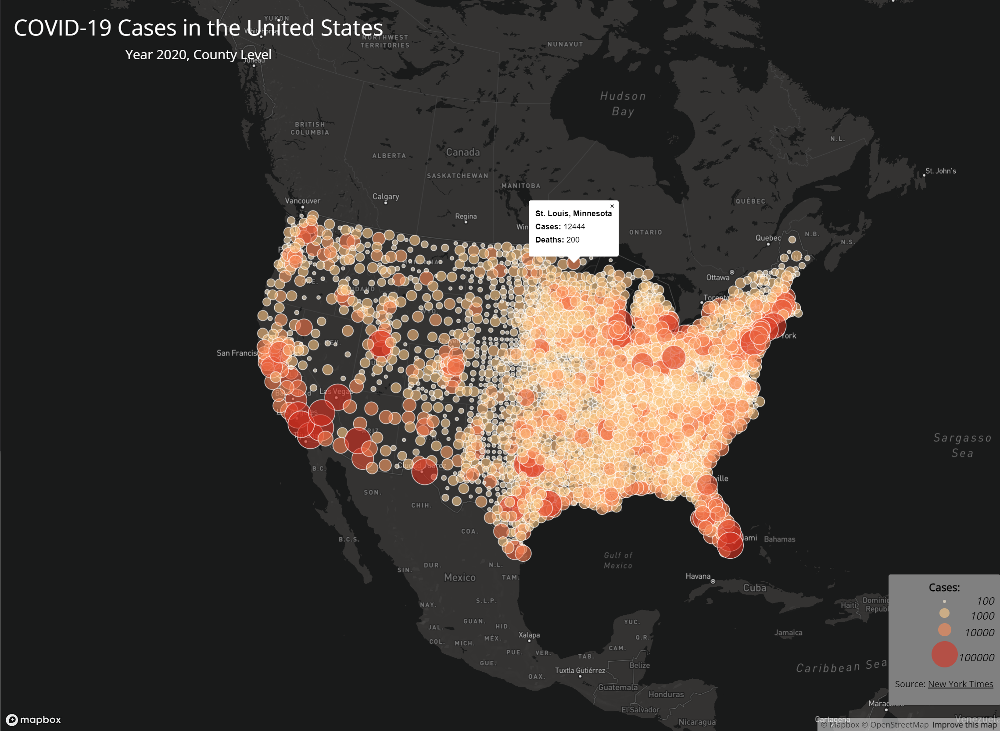

# GEOG 480 Lab 3: Web Map Application / COVID Maps

## Introduction

This map project leverages COVID-19 case and death data from 2020, originally compiled by The New York Times, with population data from the 2018 ACS 5-year estimates, all at the county level. It includes processed data to calculate case rates per thousand residents, using U.S. county boundary shapefiles from the U.S. Census Bureau. The project culminates in the creation of two thematic maps: a choropleth map displaying COVID-19 rates and a proportional symbols map showing case counts.

## Map 1: Choropleth Map of COVID-19 Case Rates

[Link to the map](https://lawrence03.github.io/geog458_lab03_covid_maps/map1.html)

Primary function: click on a point to display a popup including the county name, case rate, case count and death count.

## Map 2: Thematic Map of COVID-19 Case Counts

[Link to the map](https://lawrence03.github.io/geog458_lab03_covid_maps/map2.html)

Primary function: click on a point to display a popup including the county name, case count and death count.

## Libraries in use

- [Mapbox GL JS](https://docs.mapbox.com/mapbox-gl-js/api/)
- [Google Fonts](https://fonts.google.com/)

## Data sources

- [The New York Times](https://github.com/nytimes/covid-19-data/blob/43d32dde2f87bd4dafbb7d23f5d9e878124018b8/live/us-counties.csv)
- [the U.S. Census Bureau](https://data.census.gov/cedsci/table?g=0100000US.050000&d=ACS%205-Year%20Estimates%20Data%20Profiles&tid=ACSDP5Y2018.DP05&hidePreview=true)

## Acknowledgements

Both maps are based on the tutorial by Bo Zhao's lab instructions, [GEOG 458 Lab 3](https://github.com/jakobzhao/geog458/tree/master/labs/lab03) and [GEOG 328 Lab 4](https://github.com/jakobzhao/geog328/tree/main/labs/lab04).
